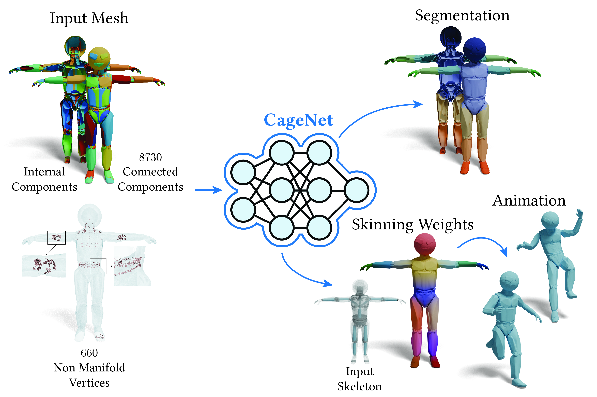

# CageNet: A Meta-Framework for Learning on Wild Meshes

[Paper and Supplemental (arXiv)](https://www.arxiv.org/abs/2505.18772)  
[License: CC BY-NC-SA 4.0](https://creativecommons.org/licenses/by-nc-sa/4.0/)


By Michal Edelstein, [Hsueh-Ti Derek Liu](https://www.dgp.toronto.edu/~hsuehtil/), and [Mirela Ben-Chen](https://mirela.net.technion.ac.il/)




If you have any questions, please contact Michal Edelstein at edel.michal@gmail.com.


## Coming soon
Stay tuned — code will be released here shortly, including a PyTorch implementation, pretrained models, and instructions to reproduce the results in the paper.


## Citation

If you find this work useful, please cite our paper:

```
@inproceedings{edelstein2025cagenet,
  title={CageNet: A Meta-Framework for Learning on Wild Meshes},
  author={Edelstein, Michal and Liu, Hsueh-Ti Derek and Ben-Chen, Mirela},
  year = {2025},
  doi = {10.1145/3721238.3730654},
  booktitle = {Proceedings of the Special Interest Group on Computer Graphics and Interactive Techniques Conference Conference Papers},
  numpages = {11},
  series = {SIGGRAPH Conference Papers '25}
}
```